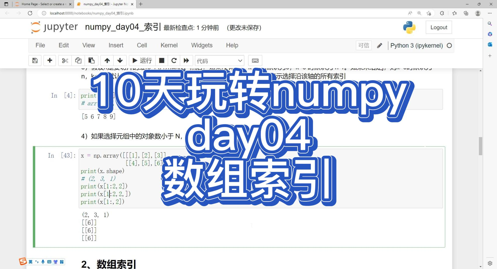
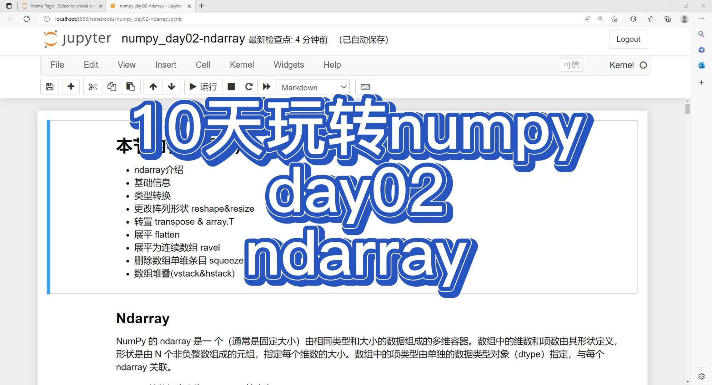

# numpy_study_demo
官网地址：https://www.aiexplorer.blog/

- AI在线体验站点（最新）
- AI能力私有化部署指南
- 深度学习算法原理讲解
- Pytorch深度学习算法开发教程

# numpy视频录制
| 日期 | 标题 | 封面 | 时长 | 视频（播放数） |
| --: | -- | -- | --: | -- |
 5/22/23 | 10天玩转numpy-day08-进阶02|  | 14:05 | |
 5/21/23 | 10天玩转numpy-day07-进阶01|  | 11:58 | |
 5/13/23 | 10天玩转numpy-day06-数学计算|  | 18:38 | |
 5/12/23 | 10天玩转numpy-day05-结构化数据类型|  | 08:28 | |
 5/10/23 | 10天玩转numpy-day04-数组索引|  | 12:57 | |
| 5/09/23 | 10天玩转numpy-day03-数组创建|  | 13:02 | |
| 5/07/23 | 10天玩转numpy-day02-ndarray|  | 20:37 | |
| 5/05/23 | 10天玩转numpy-day01-基础入门 |  | 10:30 | |
