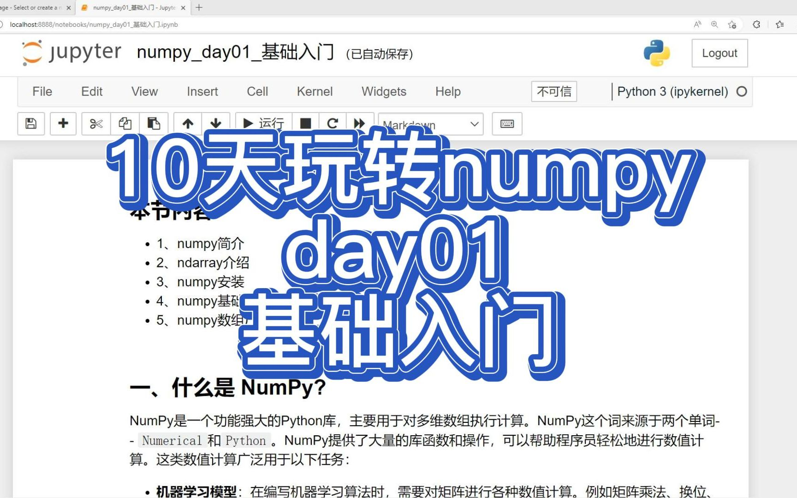

# numpy_study_demo
官网地址：https://www.aiexplorer.blog/

- AI在线体验站点（最新）
- AI能力私有化部署指南
- 深度学习算法原理讲解
- Pytorch深度学习算法开发教程

# numpy视频录制
| 日期 | 标题 | 封面 | 时长 | 视频（播放数） |
| --: | -- | -- | --: | -- |
| 5/5/23 | 10天玩转numpy-day01-基础入门 |  | 10:30 | |